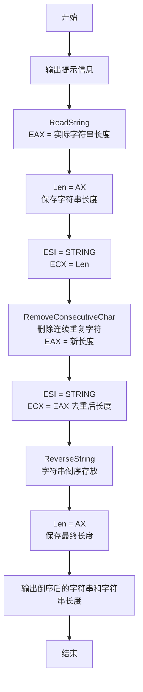
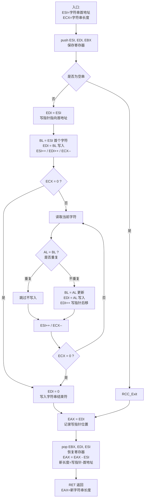
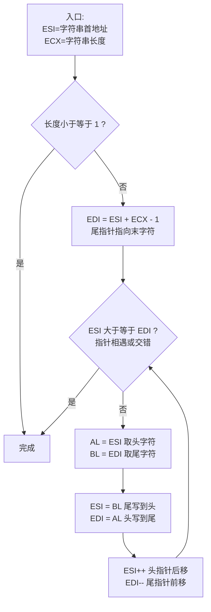

# 程序流程图

## 1. 主程序流程图 (main)

## 2. RemoveConsecutiveChar 子程序流程图

## 3. ReverseString 子程序流程图

## 算法说明

### 删除连续重复字符算法
采用双指针法原地操作：
- **读指针 (ESI)**: 遍历原始字符串
- **写指针 (EDI)**: 指向去重后字符串的当前写入位置
- 维护变量 BL 记录上一个写入的字符，如果当前字符与 BL 相同则跳过，否则写入并更新 BL

### 字符串倒序算法
采用双指针从两端向中间靠拢：
- **头指针 (ESI)**: 初始指向字符串首字符
- **尾指针 (EDI)**: 初始指向字符串末字符
- 交换两个指针所指字符，然后头指针后移、尾指针前移，直至两者相遇

### 示例
输入: `aaabccadcccl1222`
- 去重后: `abcadcl12`
- 倒序后: `21lcdacba`
