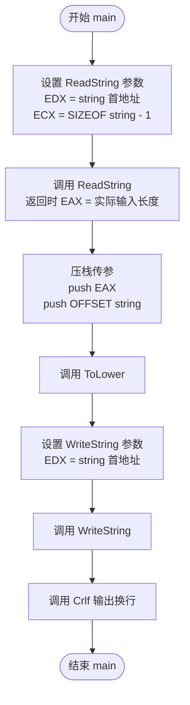

# `tolower.asm` 流程图

## 主程序 `main`

```mermaid
flowchart TD
    A([开始 main]) --> B[设置 ReadString 参数<br/>EDX = string 首地址<br/>ECX = SIZEOF string - 1]
    B --> C[调用 ReadString<br/>返回时 EAX = 实际输入长度]
    C --> D[压栈传参<br/>push EAX<br/>push OFFSET string]
    D --> E[调用 ToLower]
    E --> F[设置 WriteString 参数<br/>EDX = string 首地址]
    F --> G[调用 WriteString]
    G --> H[调用 Crlf 输出换行]
    H --> I([结束 main])
```

## 子程序 `ToLower`

```mermaid
flowchart TD
    A([进入 ToLower]) --> B[建立栈帧并保护寄存器<br/>push ebp / mov ebp, esp<br/>push eax / push ecx / push esi]
    B --> C[取参数<br/>ESI = pString<br/>ECX = strLen]
    C --> D{ECX == 0?}
    D -- 是 --> K[恢复寄存器和栈帧<br/>pop esi / pop ecx / pop eax / pop ebp]
    D -- 否 --> E["读当前字符<br/>AL = &#91;ESI&#93;"]
    E --> F{AL < 'A'?}
    F -- 是 --> J[ESI++]
    F -- 否 --> G{AL > 'Z'?}
    G -- 是 --> J
    G -- 否 --> H["&#91;ESI&#93; += 20h<br/>把大写字母转成小写"]
    H --> J[ESI++]
    J --> L{loop 后 ECX != 0?}
    L -- 是 --> E
    L -- 否 --> K
    K --> M([ret 8 返回])
```
