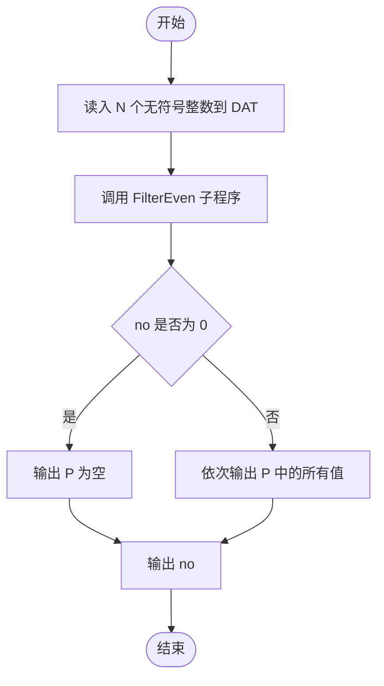
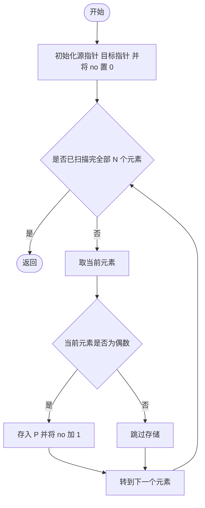

# evencnt 流程图

## 主程序

```mermaid
flowchart TD
    A([开始]) --> B[读入 N 个无符号整数到 DAT]
    B --> C[调用 FilterEven 子程序]
    C --> D{no 是否为 0}
    D -- 是 --> E[输出 P 为空]
    D -- 否 --> F[依次输出 P 中的所有值]
    E --> G[输出 no]
    F --> G
    G --> H([结束])
```

## FilterEven 子程序

```mermaid
flowchart TD
    A([开始]) --> B[初始化源指针 目标指针 并将 no 置 0]
    B --> C{是否已扫描完全部 N 个元素}
    C -- 是 --> H([返回])
    C -- 否 --> D[取当前元素]
    D --> E{当前元素是否为偶数}
    E -- 是 --> F[存入 P 并将 no 加 1]
    E -- 否 --> G[跳过存储]
    F --> I[转到下一个元素]
    G --> I
    I --> C
```
