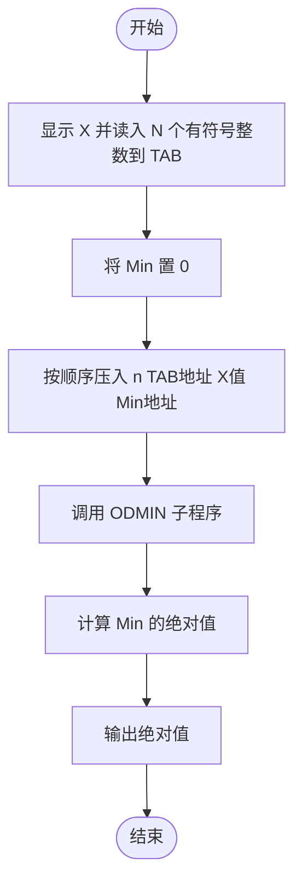
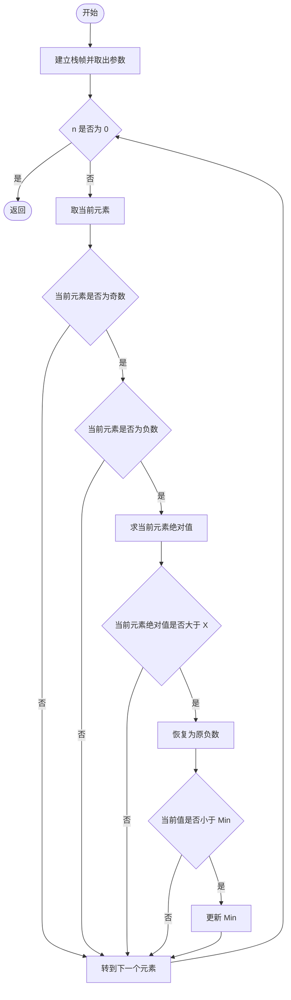

# minusodd 流程图

## 主程序

```mermaid
flowchart TD
    A([开始]) --> B[显示 X 并读入 N 个有符号整数到 TAB]
    B --> C[将 Min 置 0]
    C --> D[按顺序压入 n TAB地址 X值 Min地址]
    D --> E[调用 ODMIN 子程序]
    E --> F[计算 Min 的绝对值]
    F --> G[输出绝对值]
    G --> H([结束])
```

## ODMIN 子程序

```mermaid
flowchart TD
    A([开始]) --> B[建立栈帧并取出参数]
    B --> C{n 是否为 0}
    C -- 是 --> K([返回])
    C -- 否 --> D[取当前元素]
    D --> E{当前元素是否为奇数}
    E -- 否 --> J[转到下一个元素]
    E -- 是 --> F{当前元素是否为负数}
    F -- 否 --> J
    F -- 是 --> G[求当前元素绝对值]
    G --> H{当前元素绝对值是否大于 X}
    H -- 否 --> J
    H -- 是 --> I[恢复为原负数]
    I --> L{当前值是否小于 Min}
    L -- 否 --> J
    L -- 是 --> M[更新 Min]
    M --> J
    J --> C
```
